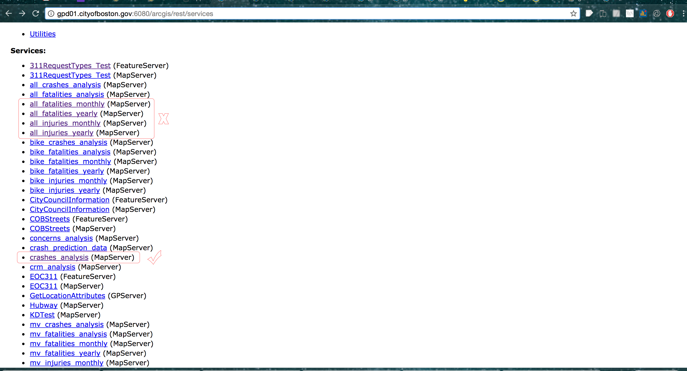
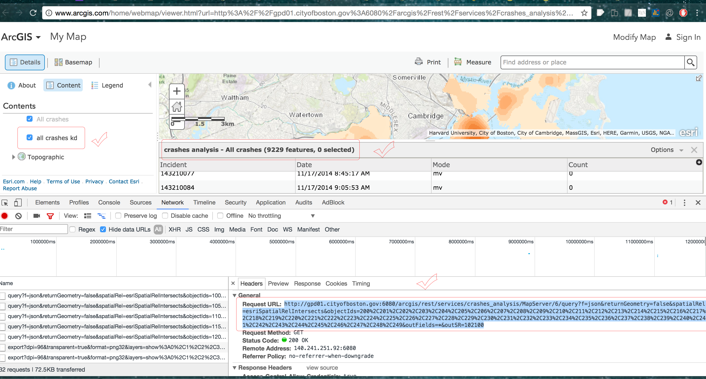

# Boston-Crash-Data-Retrieval
Retrieve Boston Crash Data from http://app01.cityofboston.gov/VisionZero/ portal.

Methodology To Obtain Vector Data and Make it Prettier ----

1. Initial investigation revealed that the data at http://app01.cityofboston.gov/VisionZero/ from MapServer is coming in in raster format and so vector data conversion or attributes generation is almost impossible. And therefore, library like Beautiful Soap etc. can't be used directly for vector data extraction.
2. A bit of play in the Developers' Section landed us up to the [ArcGIS.com portal](http://www.arcgis.com/home/webmap/viewer.html?url=http%3A%2F%2Fgpd01.cityofboston.gov%3A6080%2Farcgis%2Frest%2Fservices%2Fall_injuries_yearly%2FMapServer&source=sd) via [ArcGIS REST Services Directory](http://gpd01.cityofboston.gov:6080/arcgis/rest/services).
3. It should be noted that we are asked to obtain "Collision Data", and so we will be using "crash analysis" dataset and not the "all_fatalities____" or "all_injuries____". 
4. Going to the respective ArcGIS.com My Map page gave us the url which could be used to pull out vector data in json format. 
5. Once we had this url all we did was to generate custom url to cover all "objectIds" for 9229 features.
6. Now run the script [getDataScript.py](https://github.com/Zia-/Boston-Crash-Data-Retrieval/blob/master/getDataScript.py) with proper arguments to download and format data according to taste.
7. Data visalised in QGIS. [Screenshot](3.png)
